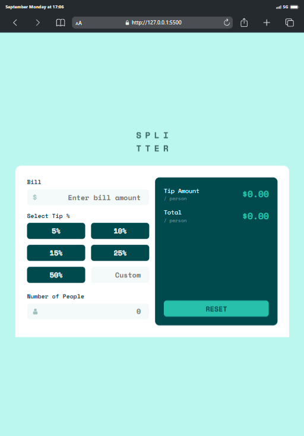
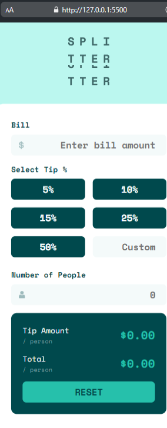
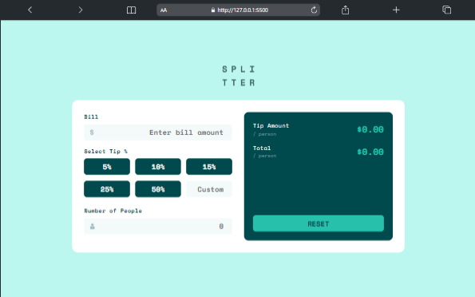

# Frontend Mentor - Tip calculator app solution

This is a solution to the
[Tip calculator app challenge on Frontend Mentor](https://www.frontendmentor.io/challenges/tip-calculator-app-ugJNGbJUX).
Frontend Mentor challenges help you improve your coding skills by building
realistic projects.

## Table of contents

- [Overview](#overview)
  - [The challenge](#the-challenge)
  - [Screenshot](#screenshot)
  - [Links](#links)
- [My process](#my-process)
  - [Built with](#built-with)
  - [What I learned](#what-i-learned)
  - [Continued development](#continued-development)
  - [Useful resources](#useful-resources)
- [Author](#author)
- [Acknowledgments](#acknowledgments)

## Overview

### The challenge

Users should be able to:

- View the optimal layout for the app depending on their device's screen size
- See hover states for all interactive elements on the page
- Calculate the correct tip and total amount per person based on the bill and
  number of people.

### Screenshot





### Links

- Solution URL:
  [Tip Calculator App](https://github.com/Mubarak-Adeyemi/tip-calculator-app-main)
- Live Site URL:
  [Tip Calculator App](https://mubarak-adeyemi.github.io/tip-calculator-app-main/)

## My process

### Built with

- Semantic HTML5
- CSS custom properties
- Flexbox
- Mobile-first workflow
- JavaScript for interactive features

### What I learned

Working on this project helped me gain a deeper understanding of a few key
areas:

#### DOM Manipulation:

I strengthened my understanding of how to dynamically update content on the page
based on user inputs. Specifically, calculating the tip and total amount using
JavaScript, and displaying the results live without needing to refresh the page.
I used event listeners to capture input values and manipulate the DOM
accordingly.

#### Responsive Design:

I applied a mobile-first approach and used CSS media queries to ensure the
layout adjusts smoothly on different screen sizes. This helped solidify my
understanding of designing for both mobile and desktop views.

#### Form Validation:

Implementing validation on the bill and number of people inputs enhanced my
understanding of form validation techniques, particularly how to show error
messages only when necessary.

Here’s a JavaScript snippet that highlights how the calculations were done for
the tip and total:

```JS
// Calculate Tip and Total per person
function calculateTip() {
  // Validate input
  if (!isValidInput()) return;

  const tipPerPerson = (billValue * tipValue) / 100 / peopleValue;
  const totalPerPerson = billValue / peopleValue + tipPerPerson;

  updateOutput(tipPerPerson, totalPerPerson);
}

// Input validation and error handling
function isValidInput() {
  let isValid = true;

  // Validate Bill input
  if (billValue <= 0 || isNaN(billValue)) {
    billErrorMsg.classList.add("invalid");
    billInput.classList.add("invalid");
    isValid = false;
  } else {
    billErrorMsg.classList.remove("invalid");
    billInput.classList.remove("invalid");
  }

  // Validate People input
  if (peopleValue <= 0 || isNaN(peopleValue)) {
    peopleErrorMsg.classList.add("invalid");
    peopleInput.classList.add("invalid");
    isValid = false;
  } else {
    peopleErrorMsg.classList.remove("invalid");
    peopleInput.classList.remove("invalid");
  }

  return isValid;
}

```

I also ensured error handling for cases where the number of people was zero, a
key edge case.

### Continued development

Moving forward, I plan to further explore ARIA attributes to enhance
accessibility. I also aim to improve my understanding of JavaScript ES6 features
for better, more maintainable code.

### Useful resources

- [CSS Tricks](https://www.example.com) - Complete Guide to CSS Grid - This
  article helped me fully understand CSS Grid.

- [MDN Web Docs](https://www.example.com) - Helped with handling form validation
  in JavaScript.

## Author

- Frontend Mentor -
  [@Mubarak-Adeyemi](https://www.frontendmentor.io/profile/Mubarak-Adeyemi)
- Twitter - [@mubarakElarabiy](https://www.twitter.com/muabarakElarabiy)

## Acknowledgments

Thanks to the Frontend Mentor community for inspiration and support.
